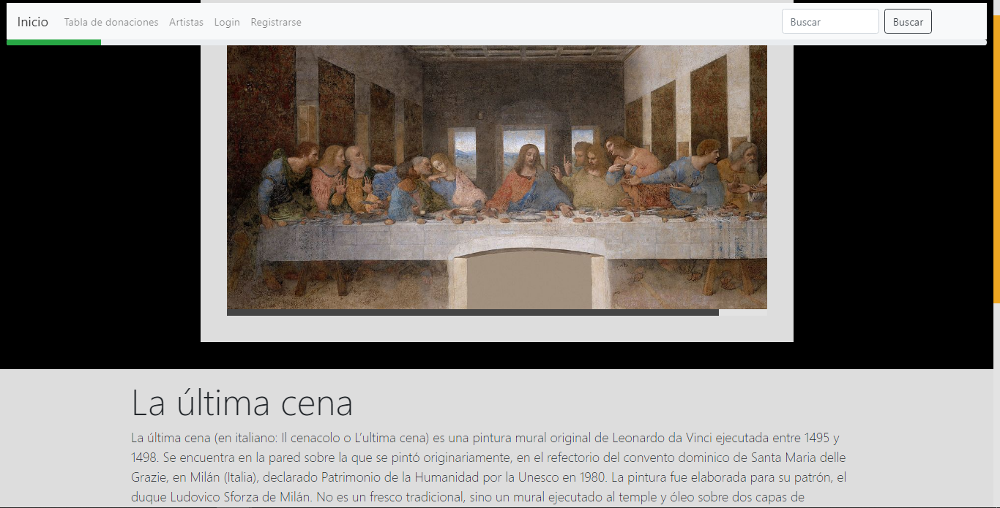

# INDEX 📋

- **Museum** 🏛
  - [**About project**](#about-project) ⭐
  - [**Preview**](#preview) 🔍
  - [**Screenshots**](#screenshots) 📷
  - [**Technologies**](#technologies) 💻
  - [**Setup**](#setup) 🔧
  - [**Usage**](#usage) 📋
  - [**Status**](#status) ⚪
  - [**Contact**](#contact) 📞


# About project⭐


**Date**: December, 2019.   
**Duration**: 1 Week.


This project was developted in order to practice with **Bootstrap 4**.
But it also has **HTML/CSS** and **jQuery** to make it works correctly.

# Preview🔍

[💠You can try it!💠](https://hukex.github.io/Museum/proyectoFinalBootstrap.html)

 
</p>

# Screenshots📷

>
>
>


# Technologies💻

- **HTML**
- **CSS**
- **JavaScript**
- [**Bootstrap 4**](https://getbootstrap.com/docs/4.3)
- [**JQuery**](https://jquery.com/)


# Setup🔧

*You are lucky* 😃 *it doesn't need installation. Just clone this repository and enjoy it.*

```bash
git clone https://github.com/Hukex/JustForTest.git
```

# Usage📋

Basically the main page (index) is **proyectoFinalBootstrap.html** just double click on the file and it will open on your predeterminated browser.
Now you can use it like it was a museum website.


# Status⚪

**Finished.**

It was for practice so it's done.

# Contact📞

My name is Fernando, you can contact me if you desire!


## 😃 Thanks for reading. 👋

